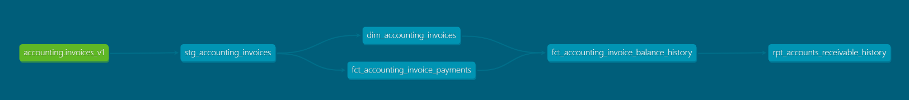
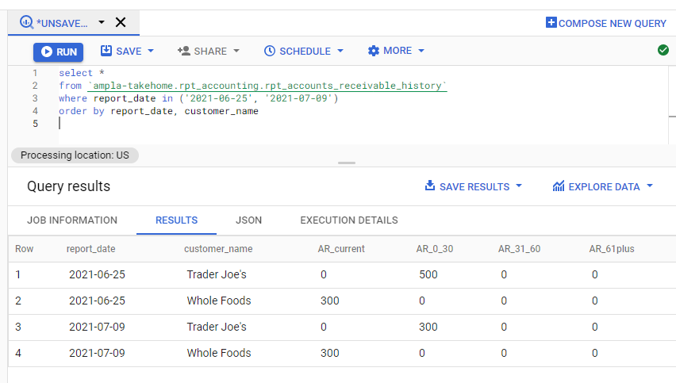

# Ampla Data Engineering Takehome

The purpose of this exercise was to ingest a .json file with records of invoices and build a pipeline transforming them to an accounting report that gives the accounts receivable for buckets of current, 0-30 day, 31-60 day, and 61+ days.  

For the ingestion, I built a [GCP cloud function](pipelines/cloud-functions/invoice-ingest/) that loads the invoice json to bigquery. Importantly, the function always loads to a **new** table with a tablename suffix created with the ingestion timestamp.  This allows us to use bigquery's wildcard table names to union all the ingested tables.  For example, given the tables: 

> `invoices_v1_2022_01_01_01_01_01`\
> `invoices_v1_2022_01_01_01_02_01`

, a select statement from `ampla-takehome.landing_invoices.invoices_v1_*` will union both tables together, with a `_TABLE_SUFFIX` value of `2022_01_01_01_01_01` and `2022_01_01_01_02_01` respectively.  This table suffix can be used in combination with the last modified timestamp to dedupe records.  It also allows for schema changes - if there's ever a new schema we need to injest, we could load the new versions into tables named `invoices_v2_*` and apply logic in [`stg_accounting_invoices`](models/staging/accounting/stg_accounting_invoices.sql) to handle the different schemas and retains the staging table's function as the single source.

The dbt pipeline follows a pattern of `source -> staging -> marts -> reporting`.  While the `marts` layer wasn't necessary for this exercise, I included it for best practice as dimension & fact tables for invoices and payments would be needed in a real data warehouse.

`staging` contains a table [`stg_accounting_invoices`](models/staging/accounting/stg_accounting_invoices.sql) that simply dedupes the json records based on a) most recent ingestion and b) most recent last updated timestamp.  This feeds two tables in `marts` - [`dim_accounting_invoices`](models/marts/accounting/dim_accounting_invoices.sql), which strips the nested payments from invoices, and [`fct_accounting_invoice_payments`](models/marts/accounting/fct_accounting_invoice_payments.sql) which unnests the payments and retains some details from their associated invoice.  Those two models then feed a daily history table, [`fct_accounting_invoice_balance_history`](models/marts/accounting/fct_accounting_invoice_balance_history.sql) which has a record for each invoice, each day beginning when it was created, and the amount outstanding & status of the invoice on that day.  

Finally, the output for the exercise is created in [`rpt_accounts_recievable_history`](models/reporting/accounting/rpt_accounts_receivable_history.sql).  It is based on  `fct_accounting_invoice_balance_history` and makes the final transformations: 
- Categorize the invoices based on their AR date bucket as of the report date
- Populate every date and every customer (assumption that we want customers to show up even if they don't have any invoices for the given date)
- Roll up all invoices to the customer/date. 

Model lineage: 



Selecting the report is as simple as doing a `select * where report_date = {given date}`.  For example, the dates given in the takehome readme:




The project & cloud function are fully functional and running on a google cloud project I created for the exercise.  Happy to share the project with you if desired.  

<details><summary>Output of dbt build</summary>

```
(venv) lpope@MSI:~/github/ampla-takehome$ dbt build
03:54:33  Running with dbt=1.0.4
03:54:33  Found 5 models, 12 tests, 0 snapshots, 0 analyses, 189 macros, 0 operations, 0 seed files, 1 source, 0 exposures, 0 metrics
03:54:33  
03:54:34  Concurrency: 4 threads (target='dev')
03:54:34  
03:54:34  1 of 17 START view model stg_accounting.stg_accounting_invoices................. [RUN]
03:54:35  1 of 17 OK created view model stg_accounting.stg_accounting_invoices............ [OK in 0.65s]
03:54:35  2 of 17 START test not_null_stg_accounting_invoices_invoice_id.................. [RUN]
03:54:35  3 of 17 START test unique_stg_accounting_invoices_invoice_id.................... [RUN]
03:54:37  3 of 17 PASS unique_stg_accounting_invoices_invoice_id.......................... [PASS in 1.73s]
03:54:37  2 of 17 PASS not_null_stg_accounting_invoices_invoice_id........................ [PASS in 1.74s]
03:54:37  4 of 17 START table model accounting.dim_accounting_invoices.................... [RUN]
03:54:37  5 of 17 START table model accounting.fct_accounting_invoice_payments............ [RUN]
03:54:40  5 of 17 OK created table model accounting.fct_accounting_invoice_payments....... [CREATE TABLE (6.0 rows, 3.4 KB processed) in 3.19s]
03:54:40  6 of 17 START test not_null_fct_accounting_invoice_payments_invoice_id.......... [RUN]
03:54:40  7 of 17 START test not_null_fct_accounting_invoice_payments_payment_id.......... [RUN]
03:54:40  8 of 17 START test unique_fct_accounting_invoice_payments_payment_id............ [RUN]
03:54:40  4 of 17 OK created table model accounting.dim_accounting_invoices............... [CREATE TABLE (4.0 rows, 3.8 KB processed) in 3.21s]
03:54:40  9 of 17 START test not_null_dim_accounting_invoices_invoice_id.................. [RUN]
03:54:41  9 of 17 PASS not_null_dim_accounting_invoices_invoice_id........................ [PASS in 1.39s]
03:54:41  8 of 17 PASS unique_fct_accounting_invoice_payments_payment_id.................. [PASS in 1.43s]
03:54:41  7 of 17 PASS not_null_fct_accounting_invoice_payments_payment_id................ [PASS in 1.44s]
03:54:41  6 of 17 PASS not_null_fct_accounting_invoice_payments_invoice_id................ [PASS in 1.44s]
03:54:41  10 of 17 START test relationships_fct_accounting_invoice_payments_invoice_id__invoice_id__ref_dim_accounting_invoices_ [RUN]
03:54:41  11 of 17 START test unique_dim_accounting_invoices_invoice_id................... [RUN]
03:54:43  10 of 17 PASS relationships_fct_accounting_invoice_payments_invoice_id__invoice_id__ref_dim_accounting_invoices_ [PASS in 1.51s]
03:54:43  11 of 17 PASS unique_dim_accounting_invoices_invoice_id......................... [PASS in 1.51s]
03:54:43  12 of 17 START table model accounting.fct_accounting_invoice_balance_history.... [RUN]
03:54:47  12 of 17 OK created table model accounting.fct_accounting_invoice_balance_history [CREATE TABLE (1.2k rows, 934.0 Bytes processed) in 4.28s]
03:54:47  13 of 17 START test not_null_fct_accounting_invoice_balance_history_invoice_id_report_date [RUN]
03:54:47  14 of 17 START test unique_fct_accounting_invoice_balance_history_invoice_id_report_date [RUN]
03:54:49  14 of 17 PASS unique_fct_accounting_invoice_balance_history_invoice_id_report_date [PASS in 1.32s]
03:54:49  13 of 17 PASS not_null_fct_accounting_invoice_balance_history_invoice_id_report_date [PASS in 1.72s]
03:54:49  15 of 17 START table model rpt_accounting.rpt_accounts_receivable_history....... [RUN]
03:54:52  15 of 17 OK created table model rpt_accounting.rpt_accounts_receivable_history.. [CREATE TABLE (670.0 rows, 55.4 KB processed) in 3.57s]
03:54:52  16 of 17 START test not_null_rpt_accounts_receivable_history_customer_name_report_date [RUN]
03:54:52  17 of 17 START test unique_rpt_accounts_receivable_history_customer_name_report_date [RUN]
03:54:54  16 of 17 PASS not_null_rpt_accounts_receivable_history_customer_name_report_date [PASS in 1.26s]
03:54:54  17 of 17 PASS unique_rpt_accounts_receivable_history_customer_name_report_date.. [PASS in 1.55s]
03:54:54  
03:54:54  Finished running 1 view model, 12 tests, 4 table models in 21.41s.
03:54:54  
03:54:54  Completed successfully
03:54:54  
03:54:54  Done. PASS=17 WARN=0 ERROR=0 SKIP=0 TOTAL=17
```
</details>